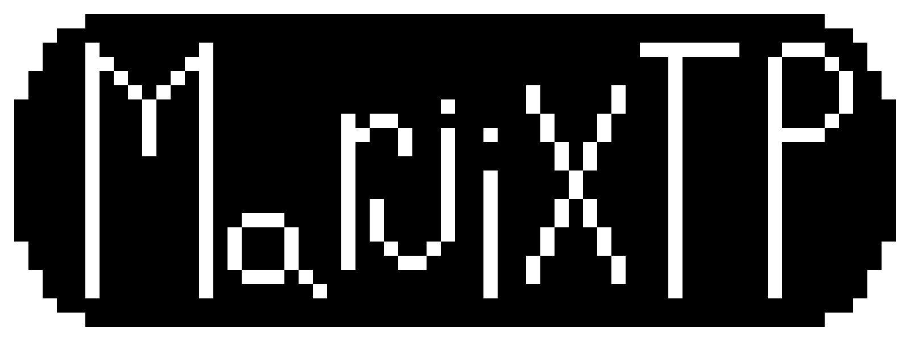

# 

# IMPORTANT
This program will NOT damage any computer!!! Anyone who claims that it destroyed their computer, must have either lied about it happening or got the software on a different source!!!
This application requires .NET 4.7.2.
This is usable in your main computer but you can use it in a VM too!

# What is this?
MarjixTP is a open source safe Windows GDI virus made for the fun of it.
Made to replicate any other GDI Trojan Horse. (Monoxide, SalineWin, InfiniteBlue, ect.)

# How can I trust it's not a real virus?
If you edit the code in Visual Studio, you'll find out there isn't any dangerous parts in it.

# What does it do?
This program has over 10 different visuals and audios!
Some can change screen color, move the screen, and more!

# Credits :
I'm giving mostly credits to [Cyber Soldier](https://www.youtube.com/watch?v=qnngjSVvpzM) for help one most of the program and [dharmatech](https://gist.github.com/dharmatech/6cb8fb83e46d56a1cc37f32e42559714) for the bytebeat stuff.
All bytebeats can be found on [dollchan](https://dollchan.net/bytebeat/) and were modified for C# and for originality.

## This is my first Trojan, expect weird things going on in the code, I've never did C# other than unity.
